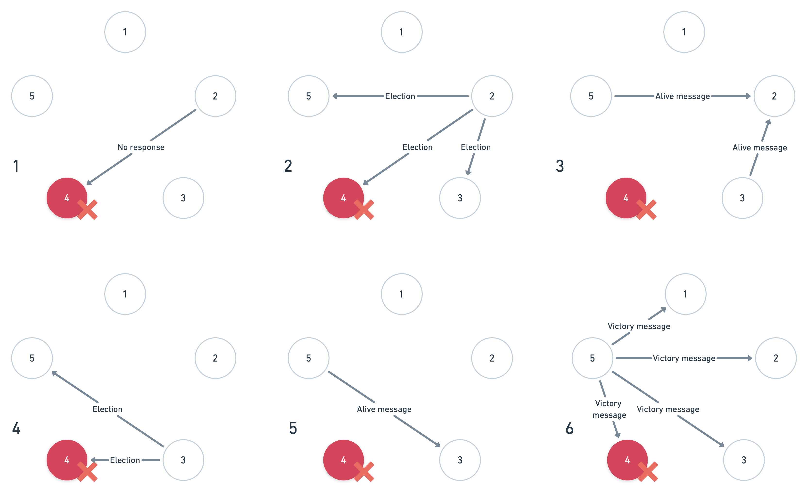
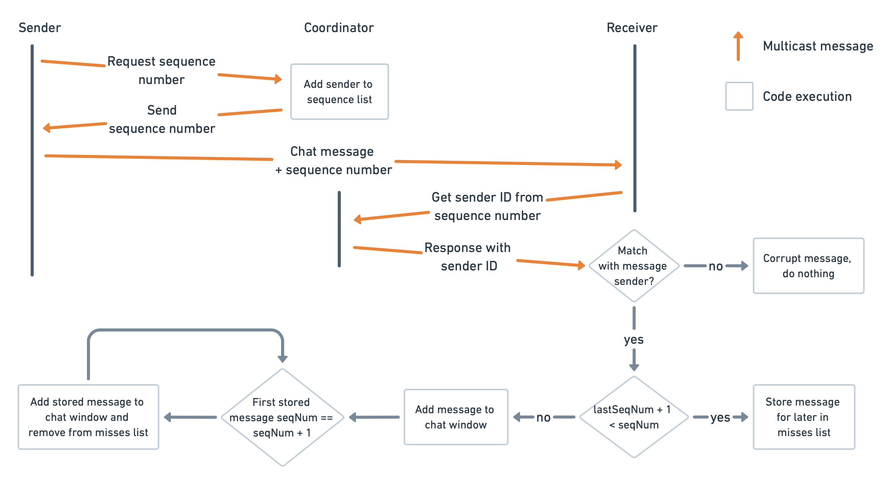

# Lab 1
Implement a basic UDP group chat using multicast.

# Lab 2 
Extend lab 1 to include vector clocks to guarantee causal ordering.

# Lab 3
Implement the bully algorithm to select a coordinator. The coordinator manages message ordering to ensure total order.

